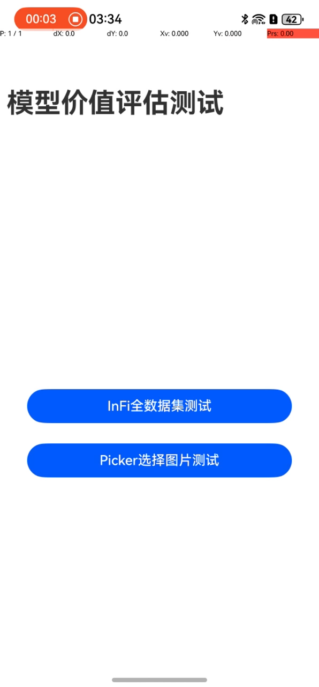

# 项目阶段一Demo ReadMe

### 介绍

该项目为模型高效推理第一阶段Demo，采用了第三方应用开发的形式，以相册应用为场景，验证模型价值评估算法的准确性和实时性。


### 效果预览

| 主页                                            |
|-----------------------------------------------|
|  |

#### 使用说明

1. 在主界面，可以点击“InFi全数据集测试”按钮，进入预存的全数据集进行测试（需要预存数据集）；
2. 在主界面，可以点击“Picker选择图片测试”按钮，进入相册中的数据进行测试。

### 工程目录

```
 ├──entry/src/main/ets/                     // 应用首页
 │  ├──common
 │  │  ├──constants                         
 │  │  │  └─CommonConstants.ets             // 常量类
 │  │  └──utils          
 │  │     └─Logger.ets                      // 日志打印类
 │  ├──entryability
 │  │  └─EntryAbility.ets                   // 程序入口类
 │  ├──model
 │  │  └─Model.ets                          // 模型推理
 │  └──pages                 
 │     └──Index.ets                         // 主页入口
 ├──entry/src/main/resource                 // 应用静态资源
 │  └──rawfile
 │     └──infi_0820_16_1024.ms               // 模型文件
 │     └──...                                // 配置中包括更多模型可选择
 └──entry/src/main/module.json5             // 模块配置相关
 
```

### 具体实现

* 本示例程序中使用的模型价值评估模型文件infi_0820_16_1024.ms ，放置在entry\src\main\resources\rawfile工程目录下。

* 调用@ohos.file.picker（图片文件选择）、@ohos.multimedia.image（图片处理效果）、@ohos.file.fs（基础文件操作） 等API实现相册图片获取及图片处理。完整代码请参见Index.ets

* 调用@ohos.ai.mindSporeLite (推理能力) API实现端侧推理。完整代码请参见model.ets

* 调用推理函数并处理结果。完整代码请参见Index.ets

* 若需要预存文件，请将图片文件放置在 `filesDir +'/dataset_InFi_0813/hw_pictures'` 目录中，其中`filesDir`为应用context中的filesDir

### 相关权限

不涉及。

### 约束与限制

1.本示例仅支持标准系统上运行，支持设备：华为手机。

2.HarmonyOS系统：HarmonyOS 5.0.0 Release及以上。

3.DevEco Studio版本：DevEco Studio 5.0.0 Release及以上。

4.HarmonyOS SDK版本：HarmonyOS 5.0.0 Release SDK及以上。

5.测试设备，Huawei Mate70pro 优享版


